<!-- 🏁 Custom Banner -->

  

<h1 align="center">Hi 👋, I'm Abhijeet Mishra</h1>
<h3 align="center">A passionate Full-Stack & Web3 Developer</h3>

  <a href="https://portfolio-gamma-coral-23.vercel.app/">Portfolio</a> ·
  <a href="https://www.linkedin.com/in/abhijeet-mishra-abhi2104/">LinkedIn</a> ·
  <a href="https://x.com/AbhijeetMi53781">X / Twitter</a> ·
  <a href="https://www.instagram.com/m.abhi.05">Instagram</a> ·
  <a href="mailto:abhijeetmishra2104@gmail.com">Email</a>

<table>
<tr>
<td width="370" valign="top">
  
</td>
<td width="490" valign="top">
  
</td>
</tr>
</table>

  

Contribution graph refreshes daily via GitHub Actions — no token, no auth.

---

## 🚀 About Me

- 🎓 Pursuing B.Tech in Electronics and Communication Engineering at IIIT Bhagalpur with a CGPA of 8.93/10.00.
- 💼 Currently acting as Training and Placement Coordinator for Batch '27.
- 🌐 Experienced in Full-Stack Web Development, optimizing RESTful APIs, and achieving 99.9% backend uptime.
- 🔗 Passionate about Web3, building provably fair smart contracts with Solidity and Chainlink VRF v2.5.
- 📧 Reach me at: **abhijeetmishra2104@gmail.com**

---

## 💼 Experience

**Training & Placement Coordinator** — Indian Institute of Information Technology, Bhagalpur
Jan 2025 – Present
- Orchestrated placement activities for 300+ students, streamlining recruitment workflows and communication — driving a 20% increase in placement rates and a 15% improvement in salary packages.

**Full-Stack Web Development Intern** — Digital Prospects Consulting
May 2025 – Jul 2025
- Built and optimized RESTful APIs with Node.js, Express, and MySQL, boosting query efficiency by 35% and holding 99.9% backend uptime.
- Integrated Redis caching, cutting API response times by 45% and enabling seamless scaling under peak traffic.
- Standardized Git branching and peer-review workflows, reducing integration issues by 15% and resolving key production crashes.

**Student Mentor** — Adhyaay, IIIT Bhagalpur
Aug 2024 – Apr 2025
- Mentored 20+ students across academics, sports, and career development while leading a 6-member team that built the Adhyaay website — automating 50% of manual admin tasks and lifting student engagement by 30%.

---

## 🚀 Projects

**SonicScribe — Full-Stack Audio Intelligence Platform** Jun 2025
- Architected a production-ready medical audio analysis platform (Next.js, Tailwind, Flask) integrated with Whisper API and LangChain, processing 1,000+ audio files at 95% API reliability.
- Built secure REST APIs for direct uploads and Cloudinary URLs, cutting backend crashes by 40% and boosting processing speed by 25%.
- Shipped CI/CD via GitHub Actions to Heroku + Vercel and Dockerized the Flask backend, eliminating 100% of build failures.

**Provably Fair Smart Contract Lottery** Jun 2026
- Engineered a decentralized lottery in Solidity + Chainlink VRF v2.5 with cryptographically secure, autonomous winner selection.
- Built a Foundry test suite (unit, stress, gas benchmarks) validated under 1,000+ concurrent users; cut transaction costs 18% via gas optimization.

**ERC-721 NFT Implementations**
- Deployed two NFT architectures in Solidity/Foundry — one with IPFS off-chain metadata, one fully on-chain with dynamic, Base64-encoded SVG metadata.
- Built a dynamic Mood NFT with mutable on-chain state, letting the metadata and artwork flip between Happy and Sad via contract calls.
- Explored EVM-level encoding (`abi.encode`, `abi.decode`, `abi.encodePacked`, function selectors, calldata, low-level calls) on Anvil and Sepolia.

**Medium — Feature-Rich Blogging Platform** Sep 2024
- Built a full-stack blogging app (React, TypeScript, Tailwind) with JWT auth, deployed frontend on Vercel + backend on Cloudflare Workers at 99.9% uptime.
- Published a reusable npm package standardizing input validation across modules, cutting validation errors by 30%.

**ERC-20 From Scratch**
- Implemented a simplified ERC-20 token in Solidity — balances, transfers, supply tracking, decimals — to internalize the EIP-20 spec.
- Automated build/test/deploy with a Foundry + Makefile workflow; deployed and verified on Sepolia via Etherscan.

---

## 🧰 Tech Arsenal

  

Languages

  

Frontend

  

Backend

  

Databases

  
  
  

DevOps / Cloud

  
  
  

Messaging & Observability

  
  
  
  

Web3 / Blockchain tooling

  
  
  
  
  

APIs / Realtime

  
  
  
  
  
  
  

---

## 📜 Certifications

- 🏆 **[ServiceNow Certified System Administrator (CSA)](https://www.credly.com/badges/55e500b4-1c0f-4655-9417-e4cf9c886c44/linked_in_profile)** — ServiceNow
- 🏆 **[Certified Application Developer (CAD)](https://www.credly.com/badges/f188e150-137c-4442-8c2f-9c0fa832ac00/linked_in_profile)** — ServiceNow
- ⛓️ **[Foundry Fundamentals](https://profiles.cyfrin.io/u/abhijeetmishra2104/achievements/foundry)** — Cyfrin Updraft
- ⛓️ **[Solidity Smart Contract Development](https://profiles.cyfrin.io/u/abhijeetmishra2104/achievements/solidity)** — Cyfrin Updraft
- ⛓️ **[Blockchain Basics](https://profiles.cyfrin.io/u/abhijeetmishra2104/achievements/blockchain-basics)** — Cyfrin Updraft
- 💻 **Full-Stack Developer** — 100xdevs
- 🤖 **[Introduction to Large Language Models](https://drive.google.com/file/d/1LDuytZZwxxQOKRpNKw3ZAMuQs3VM6vBn/view)**
- 🔒 **[Introduction to Cybersecurity](https://drive.google.com/file/d/1mmb4kZmCirU6IDLLtnATX9gU-4EgESXX/view)**